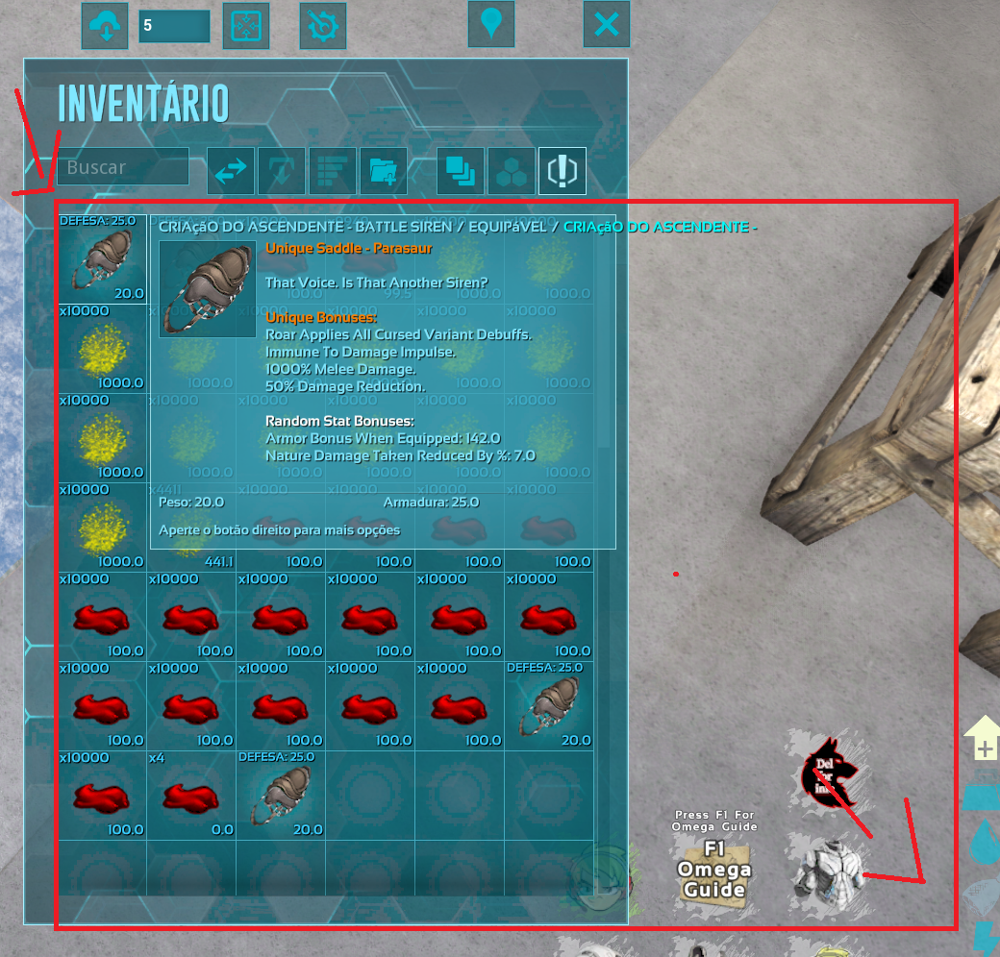

# 🦖 Ark Omega Reroll Automator

> A fast, reliable, and non-intrusive automation tool for rolling perfect stats on the Imbue Workbench in ARK: Survival Evolved (Omega Mod).

## About the Project
**ARK Reroll Automator** is a specialized macro utility designed for players of the ARK: Survival Evolved *Omega Mod*. It automates the tedious process of rerolling random stat bonuses on items (like Saddles and Armors) at the Imbue Workbench. 

Instead of manually clicking the reroll button hundreds of times and reading tooltips, this tool uses native Windows OCR to read the item stats in real-time and stops automatically when your desired stats and minimum values are achieved.


*(Replace with an actual screenshot of the interface)*

## Features
- ⚡ **Ultra-Fast OCR:** Uses native Windows 10/11 OCR for instantaneous, low-overhead text recognition.
- 🎯 **Fuzzy Matching:** Smart text analysis that gracefully handles common OCR typos (e.g., reading "Tahen" instead of "Taken").
- 📊 **Dynamic Overlay:** A transparent, click-through overlay that displays real-time reroll progress without interrupting your gameplay.
- ⌨️ **Global Hotkeys:** Fully controllable via keyboard shortcuts without needing to alt-tab out of the game.
- 💾 **Persistent Profiles:** Automatically saves your calibrations, coordinates, and target stats between sessions.

## Prerequisites
- **OS:** Windows 10 or Windows 11 (required for native Windows.Media.Ocr).
- **Python:** Python 3.10 or higher.
- **Game:** ARK: Survival Evolved running in *Windowed Fullscreen* or *Borderless* mode (Exclusive Fullscreen may hide the overlay).

## Installation

1. **Clone the repository:**
   ```bash
   git clone https://github.com/yourusername/ark-reroll-automator.git
   cd ark-reroll-automator
   ```

2. **Create a virtual environment (Recommended):**
   ```bash
   python -m venv venv
   .\venv\Scripts\activate
   ```

3. **Install dependencies:**
   ```bash
   pip install -r requirements.txt
   ```

4. **Run the application:**
   ```bash
   python main.py
   ```

## How to Use

### Step 1: Calibration
Before running the bot, you must calibrate the screen coordinates for your resolution. 
In the game:
- **[F10] Item Position:** Hover the mouse over the item in the workbench.
- **[F8] Reroll Button:** Hover the mouse over the Imbue/Upgrade button.
- **[F11] & [F12] OCR Area:** Define the top-left and bottom-right corners of the screen where the tooltip appears. *(Check the Calibration Guide for best practices).*

### Step 2: Configure Reroll
- Go to the **Ferramenta Principal** tab.
- Select your **Item Type** (Saddle or Armor).
- Check the boxes for the **Target Stats** you want.
- Set a **Minimum Value** (e.g., `50.0`). Set to `0` to accept any value for that stat.
- Adjust the maximum attempts and click delay if necessary.

### Step 3: Start Rolling
- Press the **Start** button or hit **F6** in-game.
- The app will minimize, and the transparent overlay will appear.
- Sit back and watch. The bot will automatically stop and alert you when your item hits the desired stats!

## Project Structure
```text
ark-reroll-automator/
├── main.py              # Application entry point
├── analyzer.py          # OCR parsing, text cleanup, and fuzzy matching logic
├── reroll_engine.py     # Automation engine (mouse clicks, delays, threading)
├── overlay.py           # Frameless, transparent PyQt6 overlay for real-time feedback
├── ocr_engine.py        # Asynchronous wrapper for Windows native OCR
├── stats_config.py      # Dictionaries containing supported stats and priorities
├── config_manager.py    # Auto-save and loading of JSON profiles
├── build.py             # Build script using Nuitka with auto-backup
├── requirements.txt     # Project dependencies
└── docs/                # Extended documentation and guides
```

## Compiling Executable
If you want to create a standalone `.exe` file that doesn't require Python to run:
```bash
python build.py
```
This script will automatically backup your source code, install Nuitka, and compile a highly optimized standalone executable in the `dist/` folder.

## Contributing
Contributions are what make the open-source community such an amazing place to learn, inspire, and create.
1. Fork the Project
2. Create your Feature Branch (`git checkout -b feature/AmazingFeature`)
3. Commit your Changes (`git commit -m 'Add some AmazingFeature'`)
4. Push to the Branch (`git push origin feature/AmazingFeature`)
5. Open a Pull Request

## License & Disclaimer
Distributed under the MIT License. See `LICENSE` for more information.

**Disclaimer:** This is an unofficial, community-driven tool. It is not affiliated with, endorsed by, or associated with Studio Wildcard, Instinct Games, or the creators of the ARK Omega mod. Use at your own risk.
